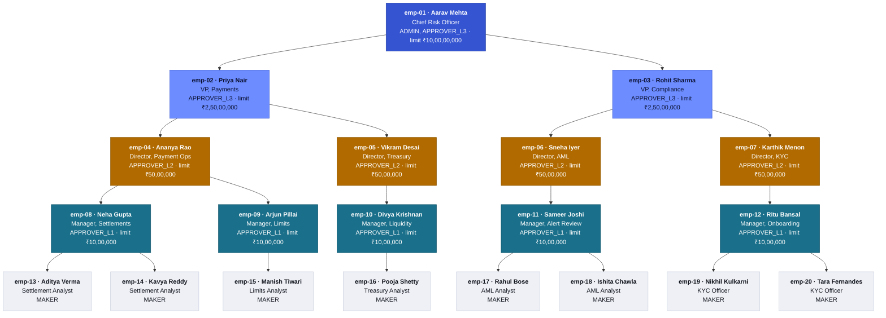

# Org chart — the demo org

The 20 people `DemoDataSeeder` creates on every backend start. One CRO → two VPs → four
Directors → five Managers → eight analysts/officers. This is the source approval chains are
resolved from: `PolicyEngine.resolveApprovers` climbs this tree from a maker upward until it
collects enough eligible signers, then backfills from the wider org if the tree runs out.

If you change the org in `DemoDataSeeder.java`, update this diagram to match — it's not
generated from the code, it's a hand-drawn mirror of it.

## Reading it

- **Color = approval limit tier**, not department. Notice Treasury (`emp-05`, `emp-10`,
  `emp-16`) sits organizationally under the VP of *Payments* (`emp-02`), not under a separate
  VP — that's deliberate seed data, not a bug, and it's why the `HIGH_VALUE_TRANSFER` chain
  in the demo script climbs through Payments leadership for a Treasury analyst's request.
- **The tree is only where chain resolution *starts*.** Policies with
  `requireManagerChain: false` (like `AML_CASE_CLOSURE`) ignore this shape entirely and pick
  checkers org-wide by role and approval limit — see `PolicyEngine.resolveApprovers` and the
  README's "Sequential vs parallel" note for why `REQ-1003` ends up with two *Payments*
  managers checking an AML case.
- **A chain can skip rungs.** `PolicyEngine` only adds a candidate if their own
  `approvalLimit` covers the request amount. A director whose limit is too low is climbed
  past, not stopped at — see the "high-value chain skips a rung" beat in the demo script.

Every account here logs in with **user ID = employee ID, password `test123`** — see the
repo README for the full table and the demo script for who to use when.
